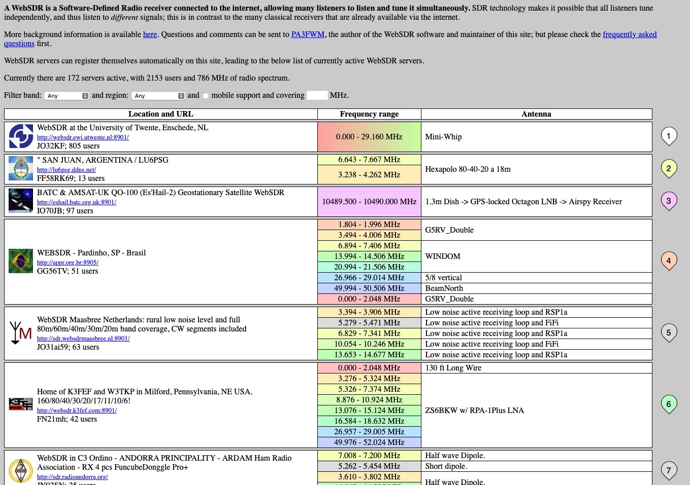

# Hands-on hamming

## Quest 1: WebSDR

Thanks to the widespread availability of inexpensive software-defined radios (SDRs), it's possible to listen to the ham bands over the internet from sites located all over the world.

In this quest, we'll check-in on the bands and listen to some [HF] [QSO]s.

1. Vist the WebSDR site at <https://websdr.org>.

You will see a screen like the following:

```{r}

```

## Quest 2: DMR

You can listen to Digital Mobile Radio ([DMR]) transmissions across the globe on the web without having to log in or have a ham radio license.

In this quest, we'll listen in on some conversations using DMR.

Remember, as a ham, all of our communications except those controlling aircraft or satellites are presumed public.

1. Visit the [Brandmeister Network](https://brandmeister.network) server's [hoseline site](https://hose.brandmeister.network).

You will see something like the following:

```{r, out.width="100%", fig.cap="Brandmeister DMR hoseline as of 2023-04-03 about 1745Z"}
knitr::include_graphics("include/img/brandmeister-hoseline-2023-04-03.png")
```

This shows all of the stations connected to the Brandmeister network in the entire world.

2. To listen in on one of these [QSO]s, click on an active QSO. Active QSOs will be outlined in <span color="red">red</span>.

```{r}
knitr::include_graphics("include/img/brandmeister-network-active-qso.png")
```

You can also listen in on specific talkgroups.
A talkgroup is like a repeater, except that it repeats signals from stations connected via the internet.
There is often traffic on talkgroup 91 (Worldwide) or talkgroup 93 (North America), so let's listen in on those.

3. Click the PLAYER button in the upper right hand corner.

This will open a small panel where you can select what talkgroups to listen to or which stations to monitor.

```{r, fig.cap="PLAYER panel from hose.brandmeister.network"}
knitr::include_graphics("include/img/brandmeister-hoseline-player-panel.png")
```


