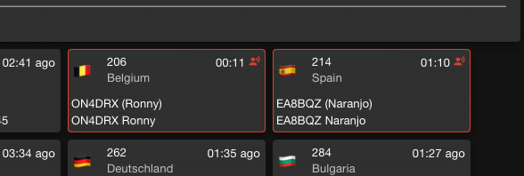

# Hands-on hamming

## Quest 1: WebSDR {- #quest-websdr}

Thanks to the widespread availability of inexpensive software-defined radios (SDRs), it's possible to listen to the ham bands over the internet from sites located all over the world.

In this quest, we'll check-in on the bands and listen to some [HF] [QSO]s.

::: {.infobox}

Here are some other web-based SDRs you might try:

http://kiwisdr.com/public/

http://www.maghull-scene.co.uk/radio.htm

:::

### Vist the WebSDR site at <https://websdr.org>. {-}

You will see a screen like the following:

```{r websdr.org, echo=FALSE, fig.align='center'}
knitr::include_graphics("include/img/websdr-org.png")
```

Scroll down to see all of the places around the world where there are webSDR stations to listen to.
You can pick any one you like, but we'll focus on one in the U.S. that we use often because it's close to our location.

### Visit the K3FEF web SDR {-}

Go to <http://websdr.k3fef.com>.
This station is located in Milford, PA on the Delaware River.
It's the closest one to Penn State.
So, it's often one to consult for listeners in our area.

Here is a screenshot of the K3FEF control panel.

```{r k3fef.com, echo=FALSE, fig.align='center', fig.cap="K3FEF webSDR at http://websdr.k3fef.com"}
knitr::include_graphics("include/img/k3fef-websdr.png")
```

The dark blue area at the top depicts the band activity at the time you visit. 
The figure shows radio signals being heard by K3FEF from about 3300 kHz (3.3 MHz) below the 80m ham band to 5300 kHz (5.5 MHz) in the 60m ham band.

If you are watching this on the web, you will see upwards motion.
This is how the webSDR depicts the time series or history of recent signals.
So, time is on the vertical axis of this two-dimensional figure.
Sometimes this type of frequency-over-time display is called a waterfall.
Except this waterfall falls upward.

Below the figure are some orange 'flag' or labels that other listeners have added.
These identify the specific transmissions.
If you look especially closely, you'll also see a yellow 'hump' around 3875 kHz.
That's the specific frequency this SDR defaulted to when we opened it up.
We'll explain what the yellow hump means a bit later.

In the static figure above, you'll notice a lot of activity between about 3550 kHz and 4000 kHz.
The 80m and 75m ham bands occupy 3500-4000 kHz, so those are hams communicating.
The figure was taken about 8:00am EDT (1200 UTC).
These bands are usually open from evening to mid-morning.

Let's focus on the white panel below the waterfall.

```{r, echo=FALSE, fig.align='center', fig.cap="K3FEF webSDR at http://websdr.k3fef.com"}
knitr::include_graphics("include/img/k3fef-websdr-panel-1.png")
```

The panel's **Frequency** control tells us that our radio is tuned to 3875 MHz, right in the middle of the 80/75m band, the phone (voice) portion.
There are some controls to change the frequency, then below that, a set of buttons to change the band.
The highlighted button confirms that we are in the 80/75m band[^1].

Notice that the K3FEF webSDR covers ham bands up through 6m.
It does not cover the 15m or 12m bands, though.

[^1]: Why is it called the 80m band and also the 75m band and sometimes the 80m/75m band? Well, 300/3.5=`r 300/3.5` and 300/4.0=`r 300/4.0`. So, the approximate speed of light (in millions of meters per second) divided by the frequency in MHz gives us the approximate wavelength of radio waves. 
It's a single 0.5 MHz (500 kHz) chunk of frequency reserved exclusively for amateurs that roughly bracket ~80-75m.

Below the **Frequency** control is a set of buttons that control **Bandwidth**.
No, bandwidth is not the size of your favorite jazz combo.
Bandwidth means how much of the frequency spectrum the webSDR is capturing at this moment, centered on the 3875 [kHz] frequency we just mentioned.
Different types of radio transmissions (voice vs. Morse code/[CW] for example) have different bandwidths.
We often want to adjust our bandwidth to match the type of signal.
If the bandwidth is much wider than the signal, we're just adding noise.
If the bandwidth is much narrower than the signal, we can lose information.
Voice transmissions have wider bandwidth than Morse code/[CW].
And different types of voice signals have different bandwidths.
[FM] is the widest, for example; [AM] is in the middle; and single sideband [SSB] the narrowest.

Our bandwidth is 9.69 [kHz] @ -6 [dB] [^2].
That's wide, except for broadcast FM stations.
We can adjust the bandwidth incrementally using the *wider*/*narrower* buttons or adjust the bandwidth to match a specific type of signal: *CW-wide*/*CW-nrw* (narrow), *LSB-wide*/*LSB-nrw*, *USB-wide*/*USB-nrw*, *AM-wide*/*AM-nrw*, and *FM*.
We can also adjust the bandwidth manually.

[^2]: This means that if we look at the peak signal at 3875 kHz and calculate the point on both sides of 3875 kHz where the signal drops by 6 decibels (db) or about 4-fold, we're left with 9.69 kHz of signal. The *width* of the yellow 'hump' in the waterfall display shows us this bandwidth visually.

#### Find a signal to listen to {-}

Click on the <span color="green">green</span> *Firefox audio start* button in the upper right hand of the screen.
Be ready to adjust the volume on your computer downward!
Or adjust the volume in the panel or even mute it (see the figure below).

Chances are that you'll just hear static since we're on a random frequency.

```{r, echo=FALSE, fig.align='center', fig.cap="K3FEF webSDR at http://websdr.k3fef.com"}
knitr::include_graphics("include/img/k3fef-websdr-panel-2.png")
```

To fix that, look at the **Waterfall view** panel. 
Zoom *in* by clicking on the button a couple of times.
Sometimes zooming moves window beyond the frequency where you are currently tuned.
If that happens, you won't see the yellow 'hump' anymore.

But you can find it again by clicking on the blue/purple area in the waterfall and dragging to the left or the right to put your current frequency--3875 kHz for our example--in the middle of the panel.

In our case, there's a very strong signal around 3810 kHz.

```{r, echo=FALSE, fig.align='center', fig.cap="K3FEF webSDR at http://websdr.k3fef.com"}

```

Notice that most of the signal around 3810 kHz (3.810 MHz) lies *below* 3810.
That's because on 75m and 80m, hams use Lower Sideband ([LSB]) for [phone] transmissions.
To see another example of what LSB and upper sideband ([USB]) signals look like, see [figure below](#fig:hf-signals).

## Quest 2: [DMR] {- #quest-dmr}

:::{.infobox}

These activities are relevant to the following license pool questions:

[T2B12](#T2B12); [T4B07](#T4B07); [T8D02](#T8D02); [T8D07](#T8D07).

:::

You can listen to Digital Mobile Radio ([DMR]) transmissions across the globe on the web without having to log in or have a ham radio license.

In this quest, we'll listen in on some conversations using DMR.

Remember, as a ham, all of our communications except those controlling aircraft or satellites are presumed public.

### Visit the [Brandmeister Network](https://brandmeister.network) {-}

The Brandmeister Network is one of the largest organizations providing DMR services.
The Brandmeister Network maintains a [hoseline site](https://hose.brandmeister.network) that shows all of the DMR traffic going through the Network.

You will see something like the following:

```{r, echo=FALSE, out.width="100%", fig.cap="Brandmeister DMR hoseline as of 2023-04-03 about 1745Z"}
knitr::include_graphics("include/img/brandmeister-hoseline-2023-04-03.png")
```

This shows all of the stations connected to the Brandmeister network in the entire world.

### Click on an active QSO {-}

To listen in on one of these [QSO]s, click on an active QSO. Active QSOs will be outlined in <span color="red">red</span>.

```{r, echo=FALSE, fig.align='center'}

```

You can also listen in on specific talkgroups.
A talkgroup is like a repeater, except that it repeats signals from stations connected via the internet.
There is often traffic on talkgroup 91 (Worldwide) or talkgroup 93 (North America), so let's listen in on those.

Click the PLAYER button in the upper right hand corner.

This will open a small panel where you can select what talkgroups to listen to or which stations to monitor.

```{r, echo=FALSE, fig.align='center', fig.cap="PLAYER panel from hose.brandmeister.network"}

```

## Quest 3: [APRS] {- #quest-aprs}

In this quest, we'll check-in on the Automatic Packet Reporting System (APRS) where hams across the world provide real-time information about their locations and exchange messages, including weather reports.

### Visit [APRS.fi](https://aprs.fi) {-}

The first time you visit this site, it may show you a view of APRS activity near the APRS.fi website author's home in Finland (hence the .fi web domain).

Feel free to scroll out using the minus (-) button in the lower right hand corner and then click and drag to another location. 
For example, here is a view near Philadelphia, PA.

```{r echo=FALSE, fig.align='center', out.width="100%", fig.cap="APRS activity near Philadelphia, PA on 2023-04-05"}
knitr::include_graphics("include/img/aprs.fi-2023-04-05.png")
```

Notice that some of the symbols look like vehicles and have a track that appears to show where they've been.

### Get more info {-}

Mouse over one of those symbols.

You should see a set of lines connecting the vehicle symbol to another one on the map.
The lines show where the RF signal from the vehicle traveled before being heard and sent over the Internet to the APRS.fi site.

```{r echo=FALSE, fig.align='center', out.width="100%", fig.cap="APRS track of moving vehicle K2WB-9."}

```

The figure shows the station K2WB connecting to a home-based relay station N2IVN and the relayed signal from N2IVN being heard by KD2DVW-1. 

### Click on a mobile (moving) station {-}

Click on a mobile (moving) station's icon.

A small window will open with information about that station.

```{r echo=FALSE, fig.align='center'}
knitr::include_graphics("include/img/aprs-k2wb-9.png")
```

Click on the info button in the small window.

```{r echo=FALSE, fig.align='center'}
knitr::include_graphics("include/img/aprs-k2wb-9-info.png")
```

### Find the International Space Station (ISS) {-}

The International Space Station has an APRS beacon! 
So, if you have an APRS-enabled radio set up you can hear the ISS when it passes near your location (and you are listening on the ISS APRS frequency of 144.825 MHz in the 2m band).

Enter `ISS` in the "Track callsign:" window in the upper right of the aprs.fi site.

I did this on the morning of 2023-04-05, and here was the result.

```{r}
knitr::include_graphics("include/img/aprs-iss-2023-04-05.png")
```

The ISS was somewhere over the North Atlantic Ocean.
I say *was*, because if you look closely, you'll see that the last time the ISS was heard on APRS was on 2023-04-04, about 20 hours before the time I took this screenshot.
The APRS beacon goes on and off from time to time.

## Quest 4: Satellite tracking {- #quest-sattelites}

Hams have launched satellites that permit communication across large areas, and the International Space Station (ISS) has ham radio equipment on board.

### Visit <https://www.n2yo.com/space-station/> {-}

The window in the upper left will show a map of the current location of the ISS.

The window in the upper right will show the current live video feed from the ISS.
If it's dark, that's probably because the ISS is on the night side of the Earth.

### Visit the [Amateur Satellite Corporation (AMSAT)](https://www.amsat.org/) {-}

The [Amateur Satellite Corporation (AMSAT)](https://www.amsat.org/) also maintains a tracking [site.](https://www.amsat.org/track/)

Here you can choose to track a number of amateur satellites.

```{r echo=FALSE, fig.align='center'}
knitr::include_graphics("include/img/amsat-track.png")
```

The site will calculate the next time a satellite will pass over your location.
You need to give it your latitude and longitude or your grid square for this to work.

What's a grid square? Well every part of the Earth has been assigned a code that is a combination of letters and numbers. The codes are part of the [Maidenhead Locator System](https://en.wikipedia.org/wiki/Maidenhead_Locator_System).

<p><a href="https://commons.wikimedia.org/wiki/File:Maidenhead_Locator_System_explained.svg#/media/File:Maidenhead_Locator_System_explained.svg"></a><br>By &lt;a href="https://en.wikipedia.org/wiki/User:Mysid" class="extiw" title="w:User:Mysid"&gt;Mysid&lt;/a&gt; - Self-drawn in Inkscape., Public Domain, <a href="https://commons.wikimedia.org/w/index.php?curid=2526302">Link</a></p>

See the following two figures from Wikipedia.

<p><a href="https://commons.wikimedia.org/wiki/File:Maidenhead_Locator_Map.png#/media/File:Maidenhead_Locator_Map.png"></a><br>By User:Denelson83 - &lt;a rel="nofollow" class="external free" href="http://visibleearth.nasa.gov/view_rec.php?id=2433"&gt;http://visibleearth.nasa.gov/view_rec.php?id=2433&lt;/a&gt;, Public Domain, <a href="https://commons.wikimedia.org/w/index.php?curid=11762818">Link</a></p>

<p><a href="https://commons.wikimedia.org/wiki/File:Maidenhead_grid_over_Europe.svg#/media/File:Maidenhead_grid_over_Europe.svg"></a><br>By Oona Räisänen (&lt;a href="https://en.wikipedia.org/wiki/User:Mysid" class="extiw" title="w:User:Mysid"&gt;Mysid&lt;/a&gt;) - Base map from &lt;a href="//commons.wikimedia.org/wiki/File:Blank_map_of_Europe_(polar_stereographic_projection)_cropped.svg" class="mw-redirect" title="File:Blank map of Europe (polar stereographic projection) cropped.svg"&gt;Image:Blank map of Europe (polar stereographic projection) cropped.svg&lt;/a&gt;; Grid drawn in Inkscape and based on the (public domain) output of Great Circle Maps v2.3., <a href="http://creativecommons.org/licenses/by-sa/3.0/" title="Creative Commons Attribution-Share Alike 3.0">CC BY-SA 3.0</a>, <a href="https://commons.wikimedia.org/w/index.php?curid=2528974">Link</a></p>

To find out your particular grid square, visit <https://www.karhukoti.com/maidenhead-grid-square-locator>.
The site gives you both your latitude and longitude and grid square.
The figure below shows my approximate location and grid square, FN10.

```{r echo=FALSE, fig.align='center'}
knitr::include_graphics("include/img/karhukoti-grid-square.png")
```

Notice that grid squares can be increasingly precise.
For our purposes now, the four character grid square is sufficient.
Hams who operate digital modes like FT8 and FT4 using the WSJT-X software use grid squares, too.
And some hams "collect" contacts in different grid squares.
For now, we'll use our grid square to calculate when the ISS will pass over our grid square.

### When will the ISS pass over you next? {-}

Enter your grid square in the AMSAT Tracking site.

Hit "Calculate Position" to let the site calculate your latitude and longitude, then hit the "Predict" button.

The results show the next several passes of the [ISS] over my grid square.
Yours will be different, even if you live in my grid square, because the ISS is always moving.

```{r echo=FALSE, fig.align='center'}

```

## Quest 5: [POTA]/[SOTA] hunting {- #quest_pota}

In this quest, you will "hunt" hams who are operating using portable stations from one of several thousand parks around the world as part of the Parks on the Air (POTA) system.

### Visit Pota.app {-}

```{r, echo=FALSE, fig.cap="Current Parks on the Air (POTA) from https://pota.app"}
knitr::include_url("https://pota.app/")
```

The site shows hams who are active on the air *right now* and on what frequencies and using which modes.

### Choose a station to "hunt" {-}

By hunt, of course, we mean try to hear on the radio.
Once you're licensed with appropriate privileges, you can try to make contact.
For now, let's just try to hear the station.

You have some decisions to make.
Which mode, CW, FT8, or phone?
Which band?

Unless you have already set up a receiver to copy and decode FT8, you can eliminate stations using [FT8] or [FT4].
Phone is the easiest, but also requires the best band conditions.

Here are some rules of thumb to guide your choices:

1. The lower frequency (higher wavelength) bands (160m, 80m/75m, 60m, and 40m) propagate longer distances at night than during the day. During the early morning hours, 80m/75m might support regional propagation, meaning you can hear stations within several hundred miles of your location. 60m and 40m might also work for regional communication throughout the day.

2. The higher bands (30m, 20m, 17m, 15m, 12m, and 10m) are long distance (DX) bands and are most active during the day and under good solar conditions.

Once you've chosen a station to hunt, you can try to hear them on a WebSDR.

### Open WebSDR {-}

If you pick a WebSDR near your location, then you'll need to consider the rules of thumb above.

If you pick a WebSDR somewhere else, you'll have to think like a ham in one of those locations: What bands are open to hams and to what parts of the world from that location?

### Tune to the POTA station frequency {-}

If the station is still active on the frequency and propagation to the WebSDR location is good, you should see a signal in the waterfall.
Try to copy the station? Can you hear the callsign? Can you hear any stations trying to call.

## Quest 6: [FT8]/[FT4] digital modes {-}

https://wsjtx.groups.io/g/main/topic/websdr_for_wsjtx/79502964

## Quest 7: Identify the signal {-}

In this quest, you'll use WebSDR or an SDR receiver to try to find and identify various signals found on the HF and VHF/UHF bands.

```{r hf-signals, echo=FALSE, fig.align='center', fig.cap="HF signal chart from https://www.reddit.com/r/amateurradio/comments/12ota0q/hf_signal_identification_chart_the_shortawaited/?utm_source=share&utm_medium=ios_app&utm_name=ioscss&utm_content=1&utm_term=10"}

```

```{r vhf-signals, echo=FALSE, fig.align='center', fig.cap="VHF signal chart from https://www.reddit.com/r/amateurradio/comments/12okhb4/i_whipped_up_a_quick_vhfuhf_signal_id_chart_might/?utm_source=share&utm_medium=ios_app&utm_name=ioscss&utm_content=1&utm_term=10"}

```

## Quest 8: Find hams in your area {-}

The FCC amateur radio license database is public.
That's why some hams prefer to use a post office (P.O.) box as their permanent surface mailing address for their license.
However, the fact that the database is public makes it easy to find hams in your geographic area.

### Open the Amateur Radio License Map application {-}

Visit <https://haminfo.tetranz.com/map>

```{r, echo=FALSE, fig.align='center', out.width="100%", fig.cap="https://haminfo.tetranz.com/map"}

```

### Search for hams in your current Zip code {-}

I live in 16801.
Here is a zoomed-out view of all the hams whose home addresses in the FCC database list 16801.

```{r, echo=FALSE, fig.align='center', out.width="100%", fig.cap="Hams in Zip code 16801 from https://haminfo.tetranz.com/map"}
knitr::include_graphics("include/img/hams-in-16801.png")
```

If you check the "Show grid labels" checkbox you will see that the map shows the 6-character [grid square] designator.
Some hams "collect" QSOs from different grid squares.
Many hams operating [FT8] or [FT4] exchange grid squares, as do those who operate amateur satellites, see the [satellite quest](#quest-satellites).

### Search for a specific callsign {-}

If you know a ham's callsign, enter it in the Callsign box.

Here is the map of licensed hams near to the mailing address for K3CR, the Penn State Amateur Radio Club's callsign.

```{r, echo=FALSE, fig.align='center', out.width="100%", fig.cap="Hams near K3CR from https://haminfo.tetranz.com/map"}

```

## Quest 9: Ham geography {-}

One of the great joys of ham radio is communicating with people in different places.
There are multiple ways to divide up the globe into smaller chunks.
In this quest, we'll explore some of the ways hams have sliced up the global pie, geographically speaking.
Each slice has its use in ham radio.

See <https://www.mapability.com/ei8ic/maps/maps.php>

### ITU Regions {-}

<https://en.wikipedia.org/wiki/ITU_Region>

```{r, echo=FALSE, fig.cap="ITU region map from https://www.mapability.com/ei8ic/maps/regions.php"}
knitr::include_graphics("https://www.mapability.com/ei8ic/maps/IARU_Regions_01.png")
```

### ITU Zones {-}

```{r, echo=FALSE, fig.cap="ITU zones map from https://www.mapability.com/ei8ic/maps/ituzone.php"}
knitr::include_graphics("https://www.mapability.com/ei8ic/maps/ITU_Zones_ARRL_01.png")
```

### DX Entities {-}

ARRL: <http://www.arrl.org/country-lists-prefixes>

<https://www.ng3k.com/Dxcc/dxcc.html>

### CQ Zones {-}

```{r, echo=FALSE, fig.cap="CQ Magazine zones map from https://www.mapability.com/ei8ic/maps/cqzone.php"}
knitr::include_graphics("https://www.mapability.com/ei8ic/maps/CQ_Zones_01.png")
```

### Callsign areas {-}

```{r, echo=FALSE, fig.cap="USA callsign areas from https://www.mapability.com/ei8ic/maps/usa_call_areas.php"}
knitr::include_graphics("https://www.mapability.com/ei8ic/maps/USA_Call_Areas_1652.png")
```

### ARRL divisions {-}

```{r, echo=FALSE, fig.cap="ARRL divisions map from https://www.mapability.com/ei8ic/maps/arrl_divisions.php"}
knitr::include_graphics("https://www.mapability.com/ei8ic/maps/ARRL_Divisions_1701.png")
```

### ARRL/RAC sections {-}

```{r, echo=FALSE, fig.cap="ARRL/RAC sections map from https://www.mapability.com/ei8ic/maps/sections_2.php"}
knitr::include_graphics("https://www.mapability.com/ei8ic/maps/ARRL_RAC_Sections_2023_1254x969.png")
```

### Summits on the Air {-}

### Parks on the Air {-}

### Maidenhead Locator {-}

<https://en.wikipedia.org/wiki/Maidenhead_Locator_System#:~:text=The%20Maidenhead%20Locator%20System%20(a.k.a.,was%20limited%20to%20European%20contacts>

<p><a href="https://commons.wikimedia.org/wiki/File:Maidenhead_Locator_Map.png#/media/File:Maidenhead_Locator_Map.png"></a><br>By User:Denelson83 - &lt;a rel="nofollow" class="external free" href="http://visibleearth.nasa.gov/view_rec.php?id=2433"&gt;http://visibleearth.nasa.gov/view_rec.php?id=2433&lt;/a&gt;, Public Domain, <a href="https://commons.wikimedia.org/w/index.php?curid=11762818">Link</a></p>

<https://www.levinecentral.com/ham/grid_square.php?Call=K3CR>

```{r, out.width="100%", echo=FALSE, fig.cap="Maidenhead locator (grid) identifier for K3CR"}
knitr::include_url("https://www.levinecentral.com/ham/grid_square.php?Call=K3CR", height="800px")
```

### Latitude/Longitude {-}

### Great Circle maps {-}

```{r, echo=FALSE, fig.cap="Great circle map centered on Washington, DC from https://www.mapability.com/ei8ic/maps/great_circle/capital_cities/washington_usa_great_circle_map.php"}
knitr::include_graphics("https://www.mapability.com/ei8ic/maps/great_circle/capital_cities/washington_usa_great_circle_map.png")
```
