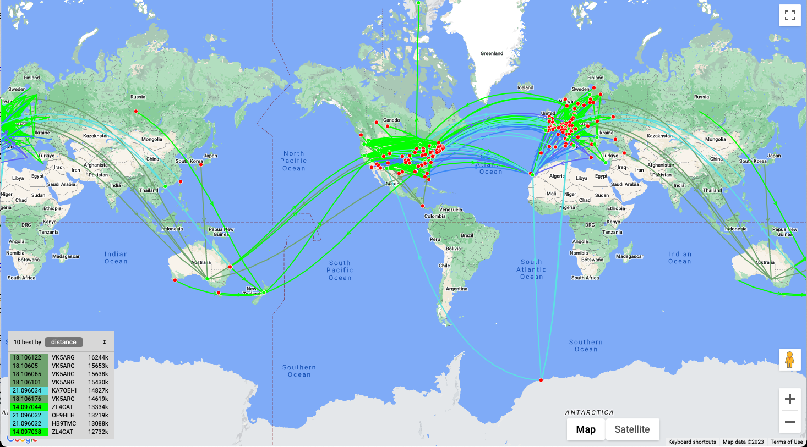
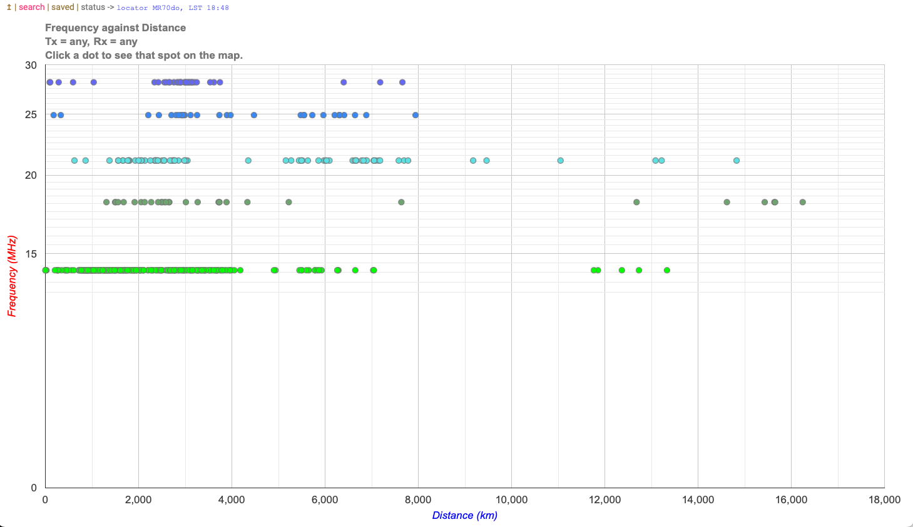

# Band conditions

Hams with HF privileges like to check in on band conditions from time to time since the conditions change regularly just like the weather.

The main things to check are what bands are open to what places.
The band or frequencies we can use to communicate with different places vary by time of day, time of year, current and long-term solar conditions.

Here are some resources to see how the bands are doing.

## HF propagation

The hfpropagation.com [site](https://www.hfpropagation.com) has some great visualizations about conditions on HF.

For example, the following shows a map of RF propagation centered on New York City:

```{r, echo=FALSE, out.width="100%", fig.cap="Propagation map centered on NYC on 2023-04-02 from https://www.hfpropagation.com"}
knitr::include_graphics("https://www.sws.bom.gov.au/Images/HF%20Systems/Global%20HF/HAP%20Charts/New%20York%20LDOCF.gif")
```

## PSK Reporter

The pskreporter.info [site](https://pskreporter.info) aggregates thousands of signal reports from hams all around the world.

For example, here is a map of conditions right now.

```{r, echo=FALSE, out.width="100%", fig.cap="https://pskreporter.info/pskmap.html"}
knitr::include_url("https://pskreporter.info/pskmap.html", height="600px")
```

## WSPR Rocks

The wspr.rocks [site](https://wspr.rocks) provides some terrific visualizations of the latest Weak Signal Propagation Report (WSPR) data.

Here is a map showing real-time data about which WSPR stations are hearing one another:

```{r, echo=FALSE, out.width="100%", fig.cap="https://http://wspr.rocks"}

```

And here is a plot of frequency vs. distance.

```{r, echo=FALSE, out.width="100%", fig.cap="https://http://wspr.rocks"}

```

20m, 17m, and 15m are long (supporting long distance or DX contacts) at the moment.